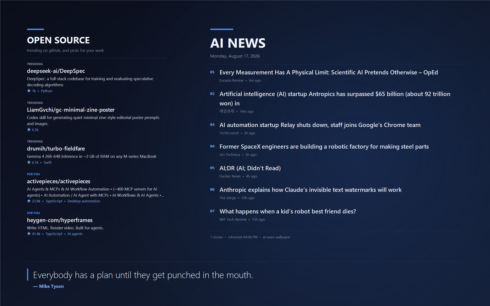

# ai-news-wallpaper

Your Windows desktop, redrawn every hour with the latest AI news, trending
open-source projects, fresh research, markets, weather and your day.

No API keys. No accounts. No AI billing. It runs entirely on your machine.



## Install

One line, no Node required:

```powershell
irm https://kshivam4781.github.io/ainewswallpaper/install.ps1 | iex
```

It downloads the latest release, puts it on your PATH, asks which city you want
the weather for, sets your wallpaper and starts the hourly refresh.

Or download `ai-news-wallpaper.exe` from
[Releases](https://github.com/kshivam4781/ainewswallpaper/releases/latest). The
binary is unsigned, so Windows SmartScreen warns on first run — **More info**,
then **Run anyway**.

With Node 18+ already installed:

```bash
npm install -g ai-news-wallpaper && ai-news-wallpaper start
```

## What lands on your screen

| Panel | What it shows |
| --- | --- |
| **AI NEWS** | headlines from seven publications, deduplicated and balanced across sources |
| **OPEN SOURCE** | rising GitHub projects, plus picks matched to what you actually work on |
| **PAPERS** | the newest arXiv submissions in AI and machine learning |
| **MARKETS** | gold, crypto, indices, currencies — gains and losses coloured |
| **WEATHER** | today and the next two days |
| **TODAY** | your calendar and top unread mail, if you connect Google |
| **Quote** | a short, hard-edged line along the bottom, changing daily |

One display shows the headlines plus two panels, rotating hourly so everything
gets seen. Add screens and the panels get homes of their own.

## Everyday use

```bash
ai-news-wallpaper update     # refresh right now
ai-news-wallpaper status     # schedule, displays and current settings
ai-news-wallpaper stop       # turn the automatic refresh off
ai-news-wallpaper --help     # everything else
```

`stop` removes the scheduled task and leaves your current wallpaper alone.

| Command | What it does |
| --- | --- |
| `update` | Fetch everything and set the wallpaper once |
| `start` | Install the scheduled task and run the first refresh |
| `stop` | Remove the scheduled task |
| `status` | Schedule, displays, and settings |
| `screens` | Detected displays and what each will show |
| `sources` | Print papers, markets, weather and Hacker News right now |
| `preview` | Render to a PNG without touching your wallpaper |
| `setup` | Register your name, optionally connect Google |
| `config` | Show or change saved settings |
| `log` | Recent activity |

## Settings

```bash
ai-news-wallpaper config --city "Mumbai" --save
ai-news-wallpaper start --interval 30 --theme carbon
```

| Flag | Default | Notes |
| --- | --- | --- |
| `--interval <min>` | `60` | Minutes between refreshes |
| `--count <n>` | `7` | Headlines to show |
| `--theme <name>` | `midnight` | `midnight`, `carbon`, `slate`, `daylight` |
| `--align <pos>` | `right` | Keeps your desktop icons clear |
| `--city <name>` | auto | Weather location; `""` returns to auto-detect |
| `--units <system>` | `metric` | `metric` or `imperial` |
| `--screens <mode>` | `auto` | `auto`, `mirror` or `single` |
| `--no-quote` | — | Hide the quote band |
| `--no-tools` | — | Hide the open-source panel |

Everything lives in `%USERPROFILE%\.ai-news-wallpaper\config.json` — feeds,
tickers, arXiv categories, your own quote list, and which panel goes on which
screen. Edit it directly for anything the flags do not cover.

## Multiple monitors

Detected automatically on every refresh; no configuration needed.

| Displays | What each shows |
| --- | --- |
| 1 | everything together |
| 2 | headlines · panels |
| 3 | headlines · panels · panels |
| 4+ | as above, then a second page of headlines |

Per-monitor wallpapers need Windows 8 or later. Where that is unavailable the
tool falls back to a single image and tells you so in `screens`.

## Privacy

Everything runs locally. There is no server and no account.

**Google is entirely optional** and off until you connect it. When you do, it
asks for the two narrowest scopes that do the job: read-only calendar events,
and Gmail **metadata only** — sender, subject and date. It cannot read the body
of a message or open an attachment, and it cannot send, delete or change
anything. Your token is stored on your own disk and revoked with:

```bash
ai-news-wallpaper disconnect google
```

Connecting needs a free Google Cloud OAuth client of your own — five minutes,
once. Run `ai-news-wallpaper connect google` and it walks you through it.

**Worth knowing:** anything on your wallpaper is readable by anyone who sees
your screen, including in a screen share. That is the point of the feature —
just choose it deliberately.

The open-source picks are matched to your work by reading your local session
history. That never leaves your machine; only a short generic search phrase is
sent to GitHub. Set `interests` in `config.json` to choose the topics yourself.

## Troubleshooting

| Problem | Try |
| --- | --- |
| Wallpaper did not change | `ai-news-wallpaper log` — every refresh writes a line |
| Task never fires | `ai-news-wallpaper status` shows next and last run |
| Wrong weather | `ai-news-wallpaper config --city "<yours>" --save` |
| Wrong screen layout | `ai-news-wallpaper screens` |
| Want your old wallpaper | `ai-news-wallpaper stop`, then pick one in Settings |

It only refreshes while you are logged in, and catches up with one run when you
come back — a sleeping machine does not update.

## Building

```bash
npm install && npm run build:exe
```

Produces a self-contained `dist/ai-news-wallpaper.exe`. Tagging a version builds
and publishes it automatically.

## Licence

MIT
